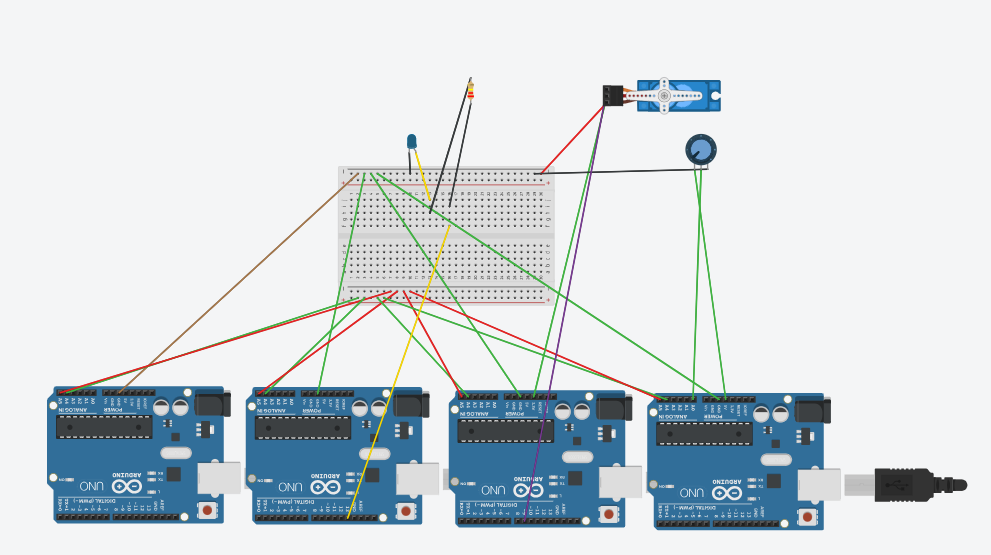

# Comunicación I2C entre 4 Arduinos

## Resumen

Esta práctica muestra cómo comunicar varios dispositivos usando el bus I2C. Se armó en Tinkercad un sistema con un Arduino maestro y tres Arduinos esclavos, cada uno con una dirección distinta, que comparten únicamente las líneas SDA y SCL más una tierra común.

El maestro consulta un potenciómetro conectado a uno de los esclavos, mueve un servomotor según ese valor, y controla un LED encendido/apagado a través del Monitor serie, todo dentro de un mismo bus.

## Objetivos

* Comprender el funcionamiento del bus I2C y su esquema maestro-esclavo.
* Asignar direcciones únicas a distintos dispositivos en un mismo bus.
* Programar el envío y la recepción de datos entre el maestro y los esclavos.
* Detectar y manejar el caso en que un esclavo no responde.
* Identificar errores comunes de montaje y de lectura de datos I2C.

## Materiales

* 4 Arduino Uno R4 WiFi
* Arduino IDE
* 1 protoboard (Breadboard Small)
* 1 LED
* 1 resistencia de 220 Ω (470 Ω en la versión adaptada al R4)
* 1 micro servo
* 1 potenciómetro
* Cables de conexión
* Opcional: 2 resistencias de 4.7 kΩ (pull-up en SDA y SCL)
* Librerías `Wire` y `Servo`, y Monitor serie

## Conexiones

| Nodo | Dirección I2C | Función |
|------|----------------|---------|
| Maestro | — | Controla el bus, consulta el potenciómetro y mueve el servo |
| Esclavo 1 | 0x08 | Enciende/apaga un LED según la orden del maestro |
| Esclavo 2 | 0x09 | Mueve un servomotor según el ángulo recibido |
| Esclavo 3 | 0x0A | Lee un potenciómetro y envía su valor al maestro |

Las cuatro placas comparten las líneas SDA (A4) y SCL (A5) y una tierra (GND) común. Cada placa se alimenta por su propio puerto USB, sin unir las líneas de 5V entre ellas.

## Diagrama

Este esquema muestra cómo se conectaron los cuatro Arduinos en Tinkercad.

[Abrir la carpeta de diagramas](Diagrama)

## Código

Hay cuatro programas, uno por cada nodo del bus: el maestro y los tres esclavos.

* [Código del maestro](codigos/Maestro.ino)
* [Código del esclavo 1 - LED](codigos/Esclavo1_LED.ino)
* [Código del esclavo 2 - Servo](codigos/Esclavo2_Servo.ino)
* [Código del esclavo 3 - Potenciómetro](codigos/Esclavo3_Potenciometro.ino)

## Video de demostración

En el video se ve el bus I2C funcionando: el maestro consultando el potenciómetro, moviendo el servo y controlando el LED por el Monitor serie.

* [Ver el video de la práctica](Video/)

[Abrir la carpeta de videos](Video)

## Pruebas y resultados

El maestro consultó correctamente al esclavo 3 cada 500 ms, convirtió el valor del potenciómetro (0-1023) a un ángulo de 0° a 180° y lo envió sin problemas al esclavo 2, que movió el servo de forma proporcional. El LED del esclavo 1 respondió de inmediato a las órdenes 1 y 0 escritas desde el Monitor serie.

La verificación del resultado de `endTransmission()` permitió detectar cuando algún esclavo no respondía, sin que el sistema se quedara congelado. Durante el armado se identificaron y corrigieron dos errores frecuentes: una resistencia con ambas patas en la misma columna de la protoboard (que dejaba pasar corriente sin limitarla) y la lectura repetida del mismo dato I2C dentro de una misma expresión (que devolvía valores inválidos a partir de la segunda lectura).

Esta comparación mostró en la práctica cómo el bus I2C permite agregar varios dispositivos usando solo dos líneas de datos, siempre que cada uno tenga una dirección distinta y el maestro controle el orden de la comunicación.

## Reporte

El reporte explica el objetivo y la descripción de la práctica, el material utilizado, el diagrama de conexión, el código de los cuatro nodos, los ajustes necesarios para el Arduino Uno R4 WiFi, los errores identificados y las conclusiones.

[Abrir el reporte](reporte/Reporte_Practica_I2C_4_Arduinos.pdf)

## Conclusiones

La práctica permitió comprobar de forma directa cómo funciona la comunicación I2C entre varios dispositivos: el maestro decide con quién habla y cuándo, mientras que cada esclavo solo responde cuando se le llama con su dirección. Agregar un nuevo esclavo al bus no requiere más pines, solo una dirección distinta, lo cual hace de I2C un protocolo muy escalable para sistemas con varios sensores y actuadores.

También se reforzó la importancia de usar `millis()` en lugar de `delay()` en el maestro, ya que esto le permite atender el Monitor serie y consultar al potenciómetro sin bloquearse, y de comprobar siempre el resultado de las transmisiones para detectar fallos de comunicación a tiempo.
