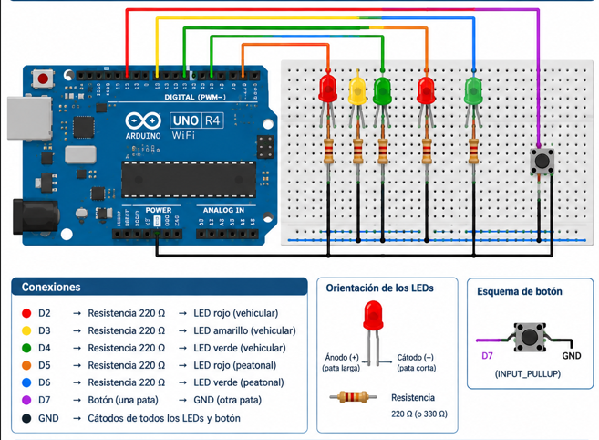

# Semáforo Vehicular y Peatonal con Botón de Cruce

## Resumen

En esta práctica se construyó un cruce con semáforo vehicular y peatonal controlado por una máquina de estados finitos (FSM) sobre una placa Arduino UNO R4 WiFi.

El circuito incluye tres luces para los vehículos (rojo, amarillo y verde), dos para los peatones (rojo y verde) y un pulsador con el que un peatón puede pedir el cruce. Todos los tiempos se miden con `millis()` y en ningún momento se usa `delay()`, así el programa puede seguir leyendo el botón mientras el semáforo continúa con su ciclo.

## Objetivos

* Entender cómo funciona una máquina de estados finitos (FSM) y cómo se aplica a un problema real.
* Modelar el semáforo como una secuencia de estados bien definidos.
* Manejar las luces vehiculares y peatonales según el estado activo.
* Sustituir `delay()` por temporización no bloqueante con `millis()`.
* Agregar un botón que permita solicitar el cruce peatonal.
* Aplicar antirrebote por software para evitar lecturas falsas del pulsador.
* Definir reglas de prioridad para que la solicitud peatonal se atienda sin riesgo.

## Materiales

* Arduino UNO R4 WiFi
* Arduino IDE
* Protoboard
* 3 LED para el semáforo vehicular (rojo, amarillo y verde)
* 2 LED para el semáforo peatonal (rojo y verde)
* Resistencias limitadoras de corriente (220 – 330 Ω)
* Pulsador
* Cables jumper

## Conexiones

| Pin | Componente | Modo |
|-----|------------|------|
| D2 | LED rojo vehicular | `OUTPUT` |
| D3 | LED amarillo vehicular | `OUTPUT` |
| D4 | LED verde vehicular | `OUTPUT` |
| D5 | LED rojo peatonal | `OUTPUT` |
| D6 | LED verde peatonal | `OUTPUT` |
| D7 | Pulsador (a GND) | `INPUT_PULLUP` |

## Estados de la FSM

| Estado | Duración | Vehicular | Peatonal |
|--------|----------|-----------|----------|
| `VEH_VERDE` | 8 s | Verde | Rojo |
| `VEH_AMARILLO` | 2 s | Amarillo | Rojo |
| `VEH_ROJO` | 6 s (o hasta atender una solicitud) | Rojo | Rojo |
| `PEA_VERDE` | 5 s | Rojo | Verde |

Secuencia: `VEH_VERDE → VEH_AMARILLO → VEH_ROJO → (PEA_VERDE) → VEH_VERDE`

## Diagramas

A continuación se muestran el esquema de conexiones y el circuito ya armado.

## Código

El sketch contiene la FSM que gobierna las luces vehiculares y peatonales y la lógica de la solicitud de cruce. Los tiempos se controlan con `millis()`, de modo que el programa nunca se queda detenido esperando.

[Abrir el código](codigo/semaforo.aia.ino)

## Video de demostración

En el video se ve el semáforo en operación, incluida su reacción cuando se pulsa el botón para pedir el cruce.

[Ver el video en YouTube](https://youtube.com/shorts/mciZtEBKvcg?feature=share)

[Ir a la carpeta de video](video)

## Pruebas y resultados

En las pruebas, el semáforo se comportó como lo define la máquina de estados. El ciclo vehicular de verde, amarillo y rojo respetó los tiempos programados, gracias a la temporización no bloqueante.

Al pulsar el botón durante el verde o el amarillo vehicular, la solicitud quedó registrada y se atendió cuando el vehicular llegó a rojo, momento en que el semáforo peatonal cambió a verde. Si no había ninguna solicitud, el ciclo siguió de forma automática.

También se verificó que el antirrebote por software funciona: una sola pulsación se registra una vez y no genera activaciones múltiples ni falsas.

Con todo esto se comprobó tanto el circuito armado en protoboard como la lógica de control basada en la FSM.

## Reporte

El reporte explica cómo funciona el sistema, la metodología seguida, el análisis de los resultados y las conclusiones de la práctica.

[Abrir el reporte](reporte/Reporte_Semaforo.pdf)

## Conclusiones

La práctica sirvió para llevar el concepto de máquina de estados finitos a un sistema de control secuencial, donde cada estado representa una fase del semáforo vehicular y peatonal.

Usar `millis()` permitió temporizar sin bloquear el programa, y el botón introdujo un evento externo que el sistema debe atender mientras sigue funcionando. Además, se comprendió por qué es necesario el antirrebote y por qué hay que fijar reglas de prioridad para atender la solicitud peatonal con seguridad.

En conjunto, la práctica ayudó a conectar la programación de una FSM con el control de componentes físicos, y su funcionamiento se comprobó con el circuito armado y las pruebas realizadas.
